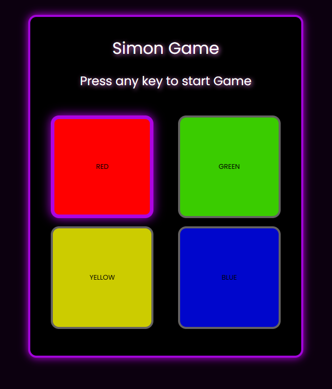

# Simon Says Game 🎮

A modern and animated version of the classic **Simon Says** memory game using HTML, CSS, and JavaScript.
Simon Says Game – A classic memory challenge built using HTML, CSS, and JavaScript.
Press any key to start, watch the color sequence, and repeat it by clicking the buttons.
With each level, the sequence gets longer and harder.
Test your memory and see how high you can score!

## 💡 How to Play
- Press any key to start the game.
- Watch the color sequence carefully.
- Repeat the sequence by clicking the color buttons in the correct order.
- The sequence gets longer with each level!

## ✨ Features
- Smooth button animations and glow effects.
- Level-based progression.
- Tracks and displays the highest score.
- Game over detection with restart instructions.

## 🚀 Built With
- HTML5
- CSS3 (with keyframe animations)
- JavaScript (DOM manipulation, event handling)

## 📷 Screenshots

## 🔗 Live Demo
 CodePen / GitHub 
 CodePen ="https://codepen.io/awadi99/pen/OPypdjg"
